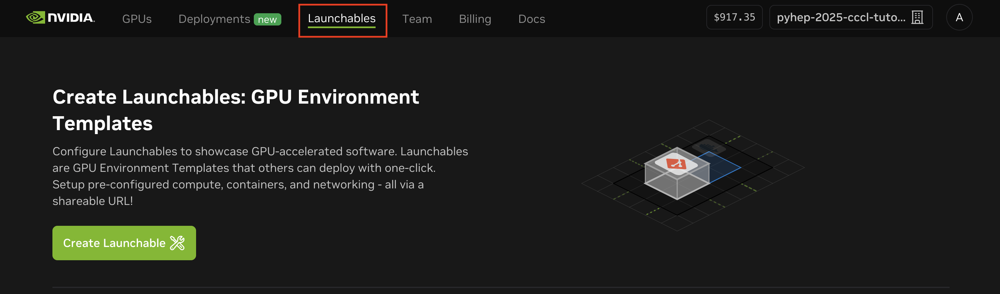

# Pythonic GPU Parallelism for HEP with `cuda.compute`

This repository contains a Jupyter notebook demonstrating how to optimize Awkward Array operations on GPUs using [cuda.compute](https://nvidia.github.io/cccl/python/compute.html).

This material was presented at the [PyHEP 2025 - "Python in HEP" Users Workshop](https://indico.cern.ch/event/1566263/overview).

## Run the notebook on `brev.nvidia.com` (workshop attendees only)

⚠️⚠️⚠️ **Please don't forget to delete or stop your instance when you're done with the notebook. Otherwise you'll burn credits shared between all workshop attendees!**

1. Sign up for an account on `brev.nvidia.com` using the invite link shared during the workshop.

2. After logging in with your account, click on "Launchables":



3. Scroll down and click "View Launchable":


4. Click the "Deploy Launchable" button


5. Click "Go to Instance Page":


6. After a few minutes, the "Open Notebook" button will be enabled. Clicking that should open a Jupyter instance where you can run the notebook:


7. ⚠️⚠️⚠️ **Please don't forget to delete or stop your instance when you're done with the notebook. Otherwise you'll burn credits shared between all workshop attendees!**


## Setup (on your own machine)

Please review the pre-requesites [here](https://nvidia.github.io/cccl/python/setup.html#prerequisites).

### Option 1: install via `pip`

Install the required packages:

```bash
pip install -r requirements-cu12.txt  # or cu13 for CUDA 13
```

### Option 2: using Docker

The repository includes a Docker Compose configuration for easy setup with GPU access:

```bash
docker-compose up -d
```

Access Jupyter Lab at `http://localhost:8888`

## Contributing

This is a tutorial/demonstration repository. Please feel free to raise an issue for discussion! For issues or improvements to:
- CUDA CCCL: See [NVIDIA/cccl](https://github.com/NVIDIA/cccl)
- Awkward Array: See [scikit-hep/awkward](https://github.com/scikit-hep/awkward)
